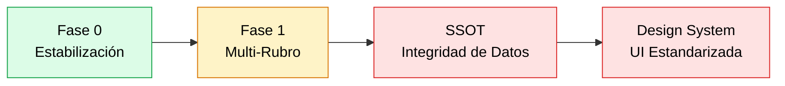

# 📊 Estado del Proyecto Pegasus SalesSystem — Verificación Completa

## Roadmap de Fases

---

## Fase 0: Estabilización ✅ 100% COMPLETADA

| # | Tarea | Estado |
|---|-------|:------:|
| 1 | `.env.example` (backend + frontend) | ✅ |
| 2 | `Dockerfile` multi-stage | ✅ |
| 3 | Ruff configurado (`pyproject.toml`) | ✅ |
| 4 | `AGENTS.md` con reglas del proyecto | ✅ |
| 5 | Skill `new-module` | ✅ |
| 6 | ESLint estricto | ✅ |
| 7 | Scripts organizados (`admin/`, `debug/`, `migrations/`, `seed/`) | ✅ |
| 8 | Código muerto eliminado | ✅ |
| 9 | `docker-compose.yml` con `sales_system_dev` | ✅ |
| 10 | `run_script.py` ejecutor centralizado | ✅ |
| 11 | `CONTRIBUTING.md` | ✅ |

---

## Fase 1: Arquitectura Base Multi-Rubro 🎉 100% COMPLETADA (LOCAL)

Plan original: [plan_implementacion_fase1.md](file:///c:/Users/rodri/Desktop/sales-system/plan_implementations/plan_implementacion_fase1.md)

### Componentes Implementados ✅

| Componente | Estado | Evidencia |
|-----------|:------:|-----------|
| **1.1 Tenant Isolation Middleware** | ✅ | `tenant_context.py` activo en `main.py`, `get_tenant_id()` en `app/utils/tenant.py` |
| **1.2 Modelo Tenant Evolucionado** | ✅ | `RubroEmpresa` enum con 5 rubros, `MODULOS_DEFAULT_POR_RUBRO` definido, campo `modulos_activos` en Tenant |
| **1.3 Refactor Sales a Clean Arch** | ✅ | `ISaleRepository` en `domain/repositories/sale_repository.py`, `MongoSaleRepository` en `infrastructure/repositories/mongo_sale_repository.py`, `SalesAnulacionService` y `SalesSyncService` extraídos. `sales_service.py` reducido a 457 líneas |
| **1.4 Feature Flags Dinámico** | ✅ | `useFeature()` hook, `hasFeature()` en authStore, `getMyFeatures()` API, sidebar filtrado por feature flags |
| **1.5 Lazy Loading Frontend** | ✅ | 37 páginas con `React.lazy()` + `Suspense` en App.tsx |

---

## Planes Adicionales Creados (Pendientes de Ejecución)

| Plan | Archivo | Estado |
|------|---------|:------:|
| **Optimización Memoria/OOM** | [optimizacion1_implementation_plan.md](file:///c:/Users/rodri/Desktop/sales-system/plan_implementations/optimizacion1_implementation_plan.md) | ✅ Ejecutado (caché eviction, N+1 caja, límites to_list) |
| **Admin SaaS Panel** | [admnsaas1_implementation_plan.md](file:///c:/Users/rodri/Desktop/sales-system/plan_implementations/admnsaas1_implementation_plan.md) | 🟡 Parcial (permisos STAFF, sidebar expandido) |
| **Restructuración** | [implementation_plan_restructuration.md](file:///c:/Users/rodri/Desktop/sales-system/plan_implementations/implementation_plan_restructuration.md) | ❌ No ejecutado |
| **SSOT Integridad Datos** | Sesión actual (no guardado en plan_implementations/) | ❌ No ejecutado |
| **Design System** | Sesión actual | ❌ No ejecutado |

---

## Propuesta: Qué Hacer Ahora

> [!IMPORTANT]
> **La Fase 1 tiene 2 componentes críticos faltantes que bloquean todo lo demás.** El Tenant Middleware es prerequisito para el SSOT (Lookup Cache Layer), y el Refactor de Sales es el patrón que se usará para migrar los demás módulos.

### Opción A: Completar Fase 1 (Recomendada)
Ejecutar los 2 componentes faltantes:
1. **1.1 Tenant Isolation Middleware** (~2h) — Crear middleware + `get_tenant_id()` dependency
2. **1.3 Refactor Sales a Clean Arch** (~6h) — Separar `sales_service.py` (52KB) en Repository + Service + dividir en archivos < 500 líneas

### Opción B: Saltar a SSOT directamente
Si prefieres resolver el problema de integridad de datos primero, podemos hacer el SSOT sin el middleware (aunque el `TenantContext` cache que planificamos se beneficiaría del middleware).

### Opción C: Plan fusionado
Combinar el Tenant Middleware (Fase 1) + TenantContext Cache (SSOT Fase 1) en un solo paso, ya que son complementarios.

> [!WARNING]
> **¿Cuál prefieres?** Necesito tu decisión para crear el plan de ejecución detallado.
