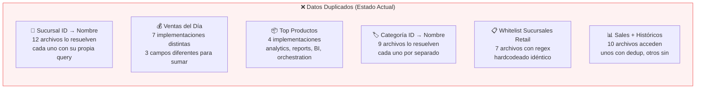
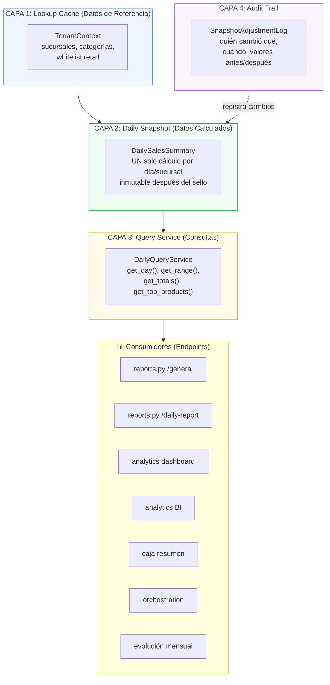
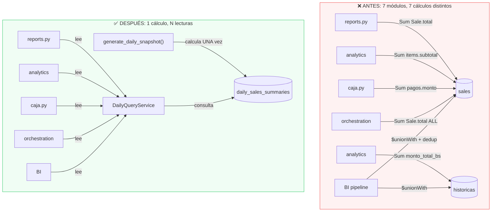

# 🏛️ Arquitectura de Integridad de Datos — Plan Integral SSOT

## El Diagnóstico Completo

No es solo "ventas diarias". Tu sistema tiene **6 tipos de datos** que se computan de forma independiente y duplicada en múltiples archivos:



### Tabla de Duplicación Encontrada

| Dato | Archivos que lo computan | Implementaciones distintas | Riesgo |
|------|------------------------|---------------------------|--------|
| **Ventas del día** | 7 | 7 (Sale.total, pagos.monto, items.subtotal) | 🔴 Crítico |
| **Sucursal ID→Nombre** | 12 | 3 (directa, regex, whitelist) | 🟡 Alto |
| **Whitelist sucursales retail** | 7 | 1 (pero hardcodeado 7 veces) | 🟡 Alto |
| **Categoría ID→Nombre** | 9 | 2 (Beanie lookup, PyMongo $lookup) | 🟡 Medio |
| **Top productos** | 4 | 4 (distintos pipelines/lógica) | 🟠 Medio |
| **Sales + Históricos dedup** | 10 | 3 (sin dedup, por original_sale_id, por $group) | 🔴 Crítico |

---

## La Solución: Arquitectura de 4 Capas

### Principio: **Cada dato tiene UNA sola fuente. Todo el mundo lee de ahí.**



---

## Fase 1: Lookup Cache Layer — Datos de Referencia Centralizados

> Eliminar las 12+ queries duplicadas de sucursal/categoría que se hacen en cada request.

#### [NEW] `backend/app/application/services/tenant_context.py`

```python
class TenantContext:
    """
    Caché en memoria (TTL 60s) de datos de referencia del tenant.
    Se inicializa UNA VEZ por request y todos los servicios lo usan.
    """
    
    @staticmethod
    @ttl_cache(seconds=60)
    async def get_sucursales(tenant_id: str) -> dict[str, str]:
        """Retorna {sucursal_id: nombre} para TODO el tenant."""
        
    @staticmethod
    @ttl_cache(seconds=60)
    async def get_sucursales_retail(tenant_id: str) -> list[str]:
        """Retorna IDs de sucursales minoristas (whitelist centralizada)."""
        # Ya NO hardcodeado. Lee el campo `tipo` de cada sucursal.
        
    @staticmethod
    @ttl_cache(seconds=60)
    async def get_categorias(tenant_id: str) -> dict[str, str]:
        """Retorna {categoria_id: nombre} para TODO el tenant."""
```

**Impacto:**
- Elimina **12 queries duplicadas** de sucursal → 1 query cacheada
- Elimina **9 queries duplicadas** de categoría → 1 query cacheada
- Elimina **7 regex hardcodeados** de whitelist → 1 campo en DB

#### [MODIFY] `backend/app/domain/models/sucursal.py`

Agregar campo `tipo` para eliminar el regex hardcodeado:
```python
tipo: str = "RETAIL"  # RETAIL | DISTRIBUCION | PRODUCCION | PRUEBA
```

---

## Fase 2: Daily Snapshot Layer — Cálculos Materializados

> Un dato se calcula UNA VEZ y se almacena. Nadie más lo recalcula.

### Reglas que definiste:
- ✅ Día = 00:00 a 23:59 Bolivia (sin offset de 4h)
- ✅ Si no se cierra caja, igual se genera el snapshot del día
- ✅ Ajustable por ADMIN/ADMIN_SUCURSAL con registro completo de auditoría
- ✅ Caja es independiente del día (puede abarcar 2 días)

#### [MODIFY] [daily_summary.py](file:///c:/Users/rodri/Desktop/sales-system/backend/app/domain/models/daily_summary.py)

Agregar campos que otros reportes necesitan:

```python
class DailySalesSummary(Document):
    # ... campos existentes ...
    
    # ── NUEVOS: Datos que otros reportes necesitan ──
    cantidad_transacciones: int = 0
    ticket_promedio: DecimalMoney = DecimalMoney("0")
    
    # Desglose por hora (para /sales-by-hour)
    por_hora: Dict[str, HourSlot] = {}  # {"08": {total, cant}, "09": {...}}
    
    # Top productos del día (para /general y dashboard)
    top_productos: List[ProductoVentaInfo] = []  # Top 10
    
    # Desglose por staff (para /staff-performance)
    por_vendedor: List[VendedorVentaInfo] = []
    
    # ── Control de Ajustes ──
    ajustes: List[SnapshotAdjustment] = []  # Historial de cambios
    version: int = 1  # Se incrementa con cada ajuste
```

#### [MODIFY] [reporting_service.py](file:///c:/Users/rodri/Desktop/sales-system/backend/app/application/services/reporting_service.py)

Completar `generate_daily_snapshot()` para calcular TODOS los datos de una vez:

```python
async def generate_daily_snapshot(...):
    # 1. SIEMPRE usar Sale.total (ESTANDARIZADO)
    # 2. SIEMPRE usar día calendario Bolivia 00:00-23:59
    # 3. Calcular: totales, por_hora, top_productos, por_vendedor, por_categoria, etc.
    # 4. Si es_definitivo y ya existe → no regenerar (inmutable)
    # 5. Usar TenantContext para nombres de sucursal/categoría
```

#### [NEW] `backend/app/domain/models/snapshot_adjustment.py`

Modelo para registrar ajustes post-sello:
```python
class SnapshotAdjustment(BaseModel):
    """Registro de auditoría para cada ajuste al snapshot."""
    ajustado_por_id: str         # User ID del admin
    ajustado_por_nombre: str     # Nombre del admin
    ajustado_at: datetime
    campo_modificado: str        # "total_bruto", "por_metodo.efectivo", etc.
    valor_anterior: str
    valor_nuevo: str
    motivo: str                  # Obligatorio
```

---

## Fase 3: Query Service Layer — Interfaz Única de Consulta

> Todos los endpoints llaman a este servicio. NADIE consulta `sales` directamente para reportes.

#### [NEW] `backend/app/application/services/daily_query_service.py`

```python
class DailyQueryService:
    """
    SSOT Query Interface — Todos los reportes usan estos métodos.
    Si el snapshot no existe, se genera al vuelo (lazy generation).
    """
    
    @staticmethod
    async def get_day(tenant_id, sucursal_id, fecha) -> DailySalesSummary:
        """Un día, una sucursal. Genera si no existe."""
        
    @staticmethod
    async def get_day_all_branches(tenant_id, fecha) -> List[DailySalesSummary]:
        """Un día, TODAS las sucursales. Para dashboard general."""
        
    @staticmethod
    async def get_range(tenant_id, start, end, sucursal_id=None) -> List[DailySalesSummary]:
        """Rango de fechas. Para evolución mensual, tendencias, etc."""
        
    @staticmethod
    async def get_aggregated(tenant_id, start, end, sucursal_id=None) -> AggregatedMetrics:
        """
        Agrega snapshots de un rango en UN solo resultado.
        Retorna: total_ventas, cant_transacciones, ticket_promedio,
                 por_metodo (consolidado), top_productos (consolidado), etc.
        Para: /general, dashboard KPIs, orchestration.
        """
        
    @staticmethod
    async def adjust_snapshot(
        tenant_id, sucursal_id, fecha,
        campo, valor_nuevo, motivo, admin_user
    ) -> DailySalesSummary:
        """Ajustar un snapshot sellado con registro de auditoría."""
```

#### Migración de Endpoints

| Endpoint Actual | Consulta Actual | Nueva Consulta |
|----------------|----------------|----------------|
| `reports.py /general` | Agrega `sales` directamente | `DailyQueryService.get_aggregated()` |
| `reports.py /daily-report` | Genera snapshot + fallback | `DailyQueryService.get_day()` |
| `reports.py /sales-by-hour` | Agrega `sales` por hora | `DailyQueryService.get_day()` → `.por_hora` |
| `reports.py /staff-performance` | Agrega `sales` por vendedor | `DailyQueryService.get_day()` → `.por_vendedor` |
| `reports.py /financial-report` | Agrega `sales` + costos | `DailyQueryService.get_aggregated()` |
| `reports.py /evolucion-mensual` | Carga TODAS las ventas a RAM | `DailyQueryService.get_range()` |
| `analytics_v2 /dashboard` | Pipeline doble (sales+hist) | `DailyQueryService.get_aggregated()` |
| `orchestration /dashboard` | Agrega `sales` con Pandas | `DailyQueryService.get_aggregated()` |

> [!IMPORTANT]
> Después de esta migración, **NINGÚN endpoint de reportes consulta `sales` directamente**. Todos pasan por `DailyQueryService` → `DailySalesSummary`.

---

## Fase 4: Auto-Sellado + Cron Job

#### [NEW] `backend/app/jobs/nightly_seal.py`

```python
async def nightly_seal():
    """
    Cron job: 00:15 AM Bolivia (04:15 UTC) — justo después de medianoche.
    
    1. Para cada tenant activo
    2. Para cada sucursal del tenant
    3. Genera/regenera el snapshot del día ANTERIOR
    4. Marca es_definitivo = True
    """
```

**Despliegue**: Usar Render Cron Job o APScheduler integrado en FastAPI.

---

## Bonus: Eliminar la Dualidad `sales` + `ventas_historicas_crudas`

> [!WARNING]
> Este es el cambio más grande pero el más importante a largo plazo.

Actualmente, 10 archivos acceden a `ventas_historicas_crudas` con lógica de deduplicación inconsistente. La solución profesional:

1. **Migración única**: Ejecutar script que mueva todos los registros de `ventas_historicas_crudas` → `DailySalesSummary` (snapshots históricos)
2. **Después de la migración**: Los snapshots anteriores a la fecha de migración se marcan como `fuente: "HISTORICO"` y son read-only
3. **Resultado**: Una sola fuente temporal → `daily_sales_summaries` para TODO dato histórico

---

## Resumen: Antes vs Después



---

## Orden de Implementación

| Fase | Qué resuelve | Archivos | Complejidad | Riesgo |
|------|-------------|----------|-------------|--------|
| **1. Lookup Cache** | 28+ queries duplicadas de referencia | 3 nuevos + 12 modificados | 🟡 Media | 🟢 Bajo |
| **2. Daily Snapshot** | Números inconsistentes | 2 modificados + 2 nuevos | 🟡 Media | 🟡 Medio |
| **3. Query Service** | Todos los reportes usan SSOT | 1 nuevo + 8 modificados | 🔴 Alta | 🟡 Medio |
| **4. Auto-Sellado** | No depende de cierre de caja | 1 nuevo + config | 🟢 Baja | 🟢 Bajo |

> [!IMPORTANT]
> **La Fase 1 y 2 se pueden hacer sin romper nada** — son aditivas. La Fase 3 es la migración de endpoints que requiere más cuidado.

## Open Questions

> [!IMPORTANT]
> 1. **¿Apruebas este plan de 4 fases?** Puedo empezar por la Fase 1+2 que son aditivas y no rompen nada.
> 2. **¿El campo `tipo` en Sucursal (RETAIL/DISTRIBUCION/PRODUCCION/PRUEBA) te parece bien?** Esto elimina los 7 regex hardcodeados.
> 3. **¿Quieres que la Fase 3 (migrar endpoints) sea gradual?** Es decir, migrar un endpoint a la vez y verificar que los números coinciden antes de seguir.
> 4. **¿Cuáles son los endpoints más críticos que deben dar los mismos números primero?** (sugerencia: `/daily-report` y el dashboard BI)
