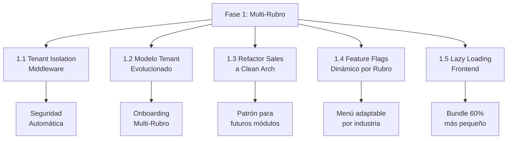
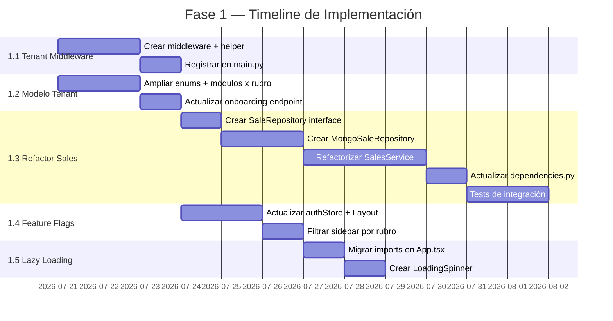

# 🏗️ Fase 1: Arquitectura Base Multi-Rubro — Plan de Implementación

## Resumen de la Fase

**Objetivo:** Transformar la base del sistema para que pueda servir a múltiples rubros (Retail, Restaurante, Dark Kitchen, Cafetería) con la misma base de código, sin romper nada de lo que ya funciona.

**Duración estimada:** 2-3 semanas  
**Riesgo para producción:** Bajo (los cambios son aditivos, no destructivos)

---

## Verificación Fase 0 — ✅ COMPLETADA

| # | Tarea | Estado |
|---|-------|:------:|
| 1 | `.env.example` (backend + frontend) | ✅ |
| 2 | `Dockerfile` multi-stage | ✅ |
| 3 | Ruff configurado (`pyproject.toml`) | ✅ |
| 4 | `AGENTS.md` con reglas del proyecto | ✅ |
| 5 | Skill `new-module` | ✅ |
| 6 | ESLint estricto (estratificado: warn general, error en `api/`) | ✅ |
| 7 | Scripts organizados (`admin/`, `debug/`, `migrations/`, `seed/`) | ✅ |
| 8 | Código muerto eliminado (`App.css`, `react.svg`, debug `.txt`) | ✅ |
| 9 | `docker-compose.yml` apunta a `sales_system_dev` | ✅ |
| 10 | `run_script.py` ejecutor centralizado | ✅ |
| 11 | `CONTRIBUTING.md` guía de contribución | ✅ |

---

## Componentes de la Fase 1



---

## 1.1 Tenant Isolation Middleware

> **Problema actual:** Cada query filtra `tenant_id` manualmente. Si un dev lo olvida → fuga de datos entre empresas.
> **Solución:** Un middleware que inyecta `tenant_id` en el request state, y helpers que lo lean automáticamente.

### Archivos a Crear/Modificar

#### [NEW] `backend/app/infrastructure/middleware/tenant_context.py`

Middleware FastAPI que extrae `tenant_id` del JWT y lo inyecta en `request.state`:

```python
from starlette.middleware.base import BaseHTTPMiddleware
from fastapi import Request

class TenantContextMiddleware(BaseHTTPMiddleware):
    """Inyecta tenant_id en request.state para que esté
    disponible en toda la cadena de procesamiento."""
    
    async def dispatch(self, request: Request, call_next):
        # Rutas públicas (login, health) no requieren tenant
        public_paths = ["/api/v1/token", "/health", "/", "/docs"]
        if request.url.path in public_paths:
            return await call_next(request)
        
        # Extraer tenant_id del token JWT (si existe)
        # Se complementa con get_current_active_user, no lo reemplaza
        token = request.headers.get("Authorization", "").replace("Bearer ", "")
        if token:
            try:
                payload = decode_jwt(token)
                request.state.tenant_id = payload.get("tenant_id")
            except Exception:
                request.state.tenant_id = None
        
        return await call_next(request)
```

#### [NEW] `backend/app/utils/tenant.py`

Helper para que los servicios accedan al `tenant_id` de forma consistente:

```python
from fastapi import Request, Depends

def get_tenant_id(request: Request) -> str:
    """Dependencia FastAPI que retorna el tenant_id del request."""
    tenant_id = getattr(request.state, "tenant_id", None)
    if not tenant_id:
        raise HTTPException(403, "Tenant no identificado")
    return tenant_id
```

#### [MODIFY] `backend/app/main.py`

Registrar el middleware:

```python
from app.infrastructure.middleware.tenant_context import TenantContextMiddleware
app.add_middleware(TenantContextMiddleware)
```

---

## 1.2 Evolución del Modelo Tenant

> **Problema actual:** El modelo `Tenant` tiene `rubro: RubroEmpresa` con solo `RETAIL`, `DARK_KITCHEN`, `SERVICIOS`. Falta `RESTAURANTE` y el mapeo de módulos por rubro.
> **Solución:** Ampliar el enum, crear configuración de módulos por rubro, y mejorar el onboarding.

### Archivos a Modificar

#### [MODIFY] `backend/app/domain/models/tenant.py`

```python
class RubroEmpresa(str, Enum):
    RETAIL       = "RETAIL"
    RESTAURANTE  = "RESTAURANTE"       # NUEVO
    DARK_KITCHEN = "DARK_KITCHEN"
    CAFETERIA    = "CAFETERIA"          # NUEVO
    SERVICIOS    = "SERVICIOS"

# Configuración default de módulos activos por rubro
MODULOS_DEFAULT_POR_RUBRO: dict[str, list[str]] = {
    "RETAIL": [
        "VENTAS", "INVENTARIO", "CAJA", "CLIENTES", "CREDITOS",
        "KARDEX", "REPORTES_BASICOS"
    ],
    "RESTAURANTE": [
        "VENTAS", "INVENTARIO", "CAJA", "CLIENTES",
        "RECETAS", "MESAS", "COMANDAS", "CARTA_DIGITAL",
        "REPORTES_BASICOS"
    ],
    "DARK_KITCHEN": [
        "VENTAS", "INVENTARIO", "RECETAS", "MEAL_PLANS",
        "PRODUCCION", "DESPACHO", "REPORTES_BASICOS"
    ],
    "CAFETERIA": [
        "VENTAS", "INVENTARIO", "CAJA", "RECETAS",
        "REPORTES_BASICOS"
    ],
    "SERVICIOS": [
        "VENTAS", "CAJA", "CLIENTES", "CREDITOS",
        "REPORTES_BASICOS"
    ],
}
```

#### [MODIFY] `backend/app/domain/models/plan_feature.py`

Agregar los nuevos features de restaurante:

```python
class PlanFeature(str, Enum):
    # ... features existentes ...
    
    # ── Módulos Restaurante (nuevos) ─────────────────────────
    MESAS            = "MESAS"            # Gestión de mesas
    COMANDAS         = "COMANDAS"         # Pantalla cocina / KDS
    CARTA_DIGITAL    = "CARTA_DIGITAL"    # Menú QR
    RESERVAS         = "RESERVAS"         # Sistema de reservas
    DELIVERY         = "DELIVERY"         # Pedidos delivery
    PROPINAS         = "PROPINAS"         # Gestión de propinas
```

#### [MODIFY] `backend/app/api/v1/endpoints/tenants.py`

En el endpoint de onboarding/creación de tenant, usar `MODULOS_DEFAULT_POR_RUBRO` para auto-asignar módulos:

```python
from app.domain.models.tenant import MODULOS_DEFAULT_POR_RUBRO

@router.post("/tenants")
async def create_tenant(data: TenantCreate, ...):
    rubro = data.rubro or RubroEmpresa.RETAIL
    modulos = MODULOS_DEFAULT_POR_RUBRO.get(rubro.value, [])
    tenant = Tenant(
        name=data.name,
        rubro=rubro,
        modulos_activos=modulos,
        ...
    )
```

---

## 1.3 Refactorización de Ventas a Clean Architecture

> **Problema actual:** [sales_service.py](file:///c:/Users/rodri/Desktop/sales-system/backend/app/application/services/sales_service.py) tiene **51KB** y accede a Beanie directamente. Es el módulo más crítico del sistema.
> **Solución:** Aplicar el patrón completo: Repository Interface → Mongo Implementation → Service → Endpoint. Esto servirá como modelo para migrar los demás módulos.

### Archivos a Crear

#### [NEW] `backend/app/domain/repositories/sale_repository.py`

```python
from abc import ABC, abstractmethod
from typing import Optional

class SaleRepository(ABC):
    @abstractmethod
    async def create(self, sale_data: dict, session=None) -> dict: ...
    
    @abstractmethod
    async def get_by_id(self, sale_id: str, tenant_id: str) -> Optional[dict]: ...
    
    @abstractmethod
    async def list_by_tenant(
        self, tenant_id: str, sucursal_id: str = None,
        page: int = 1, limit: int = 50, filters: dict = None
    ) -> tuple[list[dict], int]: ...
    
    @abstractmethod
    async def void_sale(self, sale_id: str, tenant_id: str, reason: str, voided_by: str, session=None) -> dict: ...
    
    @abstractmethod
    async def get_sales_in_period(self, tenant_id: str, start: datetime, end: datetime, sucursal_id: str = None) -> list[dict]: ...
```

#### [NEW] `backend/app/infrastructure/repositories/mongo_sale_repository.py`

Implementación concreta usando Beanie:

```python
from app.domain.repositories.sale_repository import SaleRepository
from app.domain.models.sale import Sale

class MongoSaleRepository(SaleRepository):
    async def create(self, sale_data: dict, session=None) -> dict:
        sale = Sale(**sale_data)
        await sale.insert(session=session)
        return sale.model_dump()
    
    async def get_by_id(self, sale_id: str, tenant_id: str):
        sale = await Sale.find_one(
            Sale.id == sale_id,
            Sale.tenant_id == tenant_id  # Aislamiento garantizado
        )
        return sale.model_dump() if sale else None
    # ... etc
```

#### [MODIFY] `backend/app/application/services/sales_service.py`

Refactorizar para recibir repositorio por constructor (NO acceder a Beanie directamente):

```python
class SalesService:
    def __init__(self, sale_repo: SaleRepository, inventory_repo: InventoryRepository, uow: BaseUnitOfWork):
        self.sale_repo = sale_repo
        self.inventory_repo = inventory_repo
        self.uow = uow
    
    async def create_sale(self, data: dict, tenant_id: str, user_id: str) -> dict:
        async with self.uow:
            sale = await self.sale_repo.create(data, session=self.uow.session)
            # Descontar inventario
            for item in data["items"]:
                await self.inventory_repo.deduct_stock(
                    item["product_id"], item["quantity"],
                    tenant_id, session=self.uow.session
                )
            return sale
```

#### [MODIFY] `backend/app/dependencies.py`

Registrar las nuevas dependencias:

```python
from app.infrastructure.repositories.mongo_sale_repository import MongoSaleRepository

def get_sales_service() -> SalesService:
    return SalesService(
        sale_repo=MongoSaleRepository(),
        inventory_repo=MongoInventoryRepository(),
        uow=MongoUnitOfWork()
    )
```

> [!IMPORTANT]
> Esta refactorización es la más delicada porque toca el flujo de ventas en producción. Se debe hacer de forma incremental: primero crear los nuevos archivos, luego migrar método por método, verificando que cada test pase antes de continuar.

---

## 1.4 Sistema de Feature Flags Dinámico por Rubro

> **Problema actual:** El frontend carga features desde el backend, pero la lógica de "qué módulos ve cada rubro" no es dinámica. Un restaurante ve las mismas opciones de sidebar que un retail.
> **Solución:** El backend envía la lista de `modulos_activos` del tenant, y el frontend adapta el sidebar y las rutas automáticamente.

### Archivos a Modificar

#### [MODIFY] Frontend — `src/store/authStore.ts`

Agregar campo `rubro` al store:

```typescript
interface AuthState {
  // ... campos existentes ...
  rubro: string | null;       // NUEVO: "RETAIL" | "RESTAURANTE" | etc.
}
```

#### [MODIFY] Frontend — `src/components/Layout.tsx`

El sidebar debe filtrar las opciones según `modulos_activos`:

```typescript
const { features, rubro } = useAuthStore();

const menuItems = ALL_MENU_ITEMS.filter(item => 
  features.includes(item.requiredFeature)
);
```

#### [MODIFY] Frontend — `src/App.tsx`

Las rutas deben respetar los módulos activos:

```typescript
// Solo registrar la ruta si el feature está activo
{hasFeature("MESAS") && (
  <Route path="/mesas" element={<MesasPage />} />
)}
```

---

## 1.5 Lazy Loading en el Frontend

> **Problema actual:** Las 34 páginas cargan de golpe. El bundle inicial es enorme.
> **Solución:** Usar `React.lazy()` + `Suspense` para que cada página cargue solo cuando se navega a ella.

### Archivos a Modificar

#### [MODIFY] `frontend/src/App.tsx`

Cambiar imports estáticos por dinámicos:

```typescript
// ANTES
import POSPage from './pages/POSPage';
import CajaPage from './pages/CajaPage';
import InventarioPage from './pages/InventarioPage';

// DESPUÉS
const POSPage = lazy(() => import('./pages/POSPage'));
const CajaPage = lazy(() => import('./pages/CajaPage'));
const InventarioPage = lazy(() => import('./pages/InventarioPage'));

// Envolver rutas en Suspense
<Suspense fallback={<LoadingSpinner />}>
  <Routes>
    <Route path="/pos" element={<POSPage />} />
    ...
  </Routes>
</Suspense>
```

#### [NEW] `frontend/src/components/LoadingSpinner.tsx`

Componente de carga elegante para el fallback de Suspense.

---

## Orden de Ejecución



---

## Verification Plan

### Automated Tests
```bash
# Backend — después de cada componente
cd backend
pytest tests/ -v

# Lint backend
ruff check app/

# Frontend — verificar compilación TypeScript
cd frontend
npm run build
npm run lint
```

### Manual Verification
- [ ] Login como SUPERADMIN → crear tenant RESTAURANTE → verificar que `modulos_activos` se asignan correctamente
- [ ] Login como admin de un tenant RETAIL → confirmar que NO ve opciones de Mesas/Comandas en el sidebar
- [ ] Registrar una venta completa (POS → pago → cierre) → confirmar que funciona igual que antes de la refactorización
- [ ] Verificar con DevTools del navegador que las páginas cargan bajo demanda (Network tab → chunks separados)

---

## Open Questions

> [!IMPORTANT]
> ### Preguntas para decidir antes de empezar:

1. **¿Empezamos por la refactorización de Sales (1.3) o por el Tenant Middleware (1.1)?**
   - 1.1 es más seguro (aditivo, no toca código existente)
   - 1.3 tiene más impacto pero más riesgo (toca el POS en producción)

2. **¿Quieres que cree una rama `feat/fase-1-multi-rubro` y trabaje ahí?** Así puedes revisar los cambios antes de mergear a `main`.

3. **¿Los módulos de restaurante (Mesas, Comandas, etc.) los hacemos en esta fase o los dejamos para la Fase 2?** En esta fase solo dejaríamos la "infraestructura" (enums, feature flags) y los módulos reales se construirían después.

4. **¿Hay algún módulo existente además de Sales que quieras que refactorice a Clean Architecture en esta fase?** (Ej: Inventario, Caja, Créditos)
